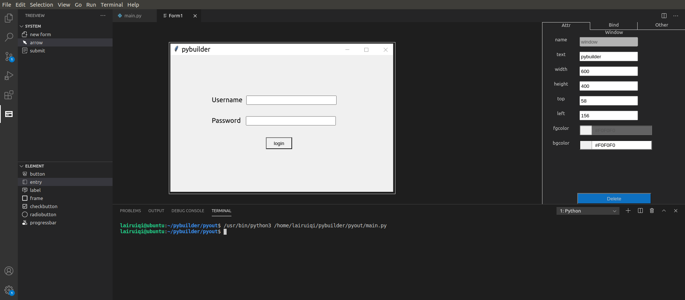
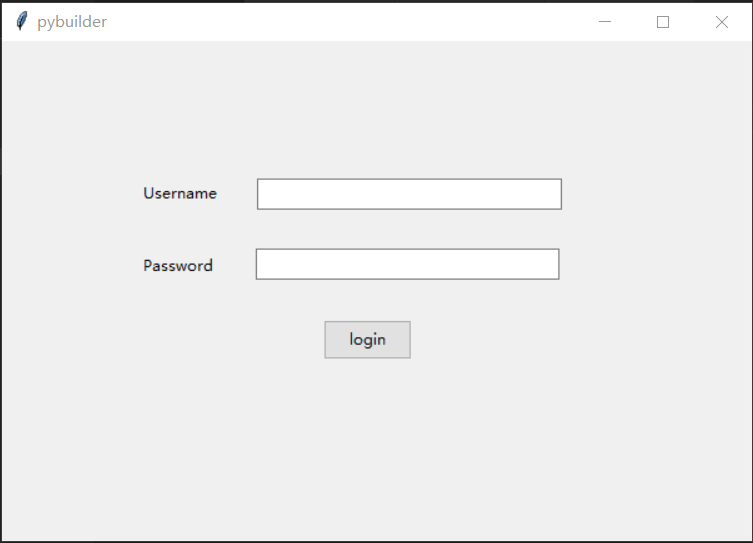
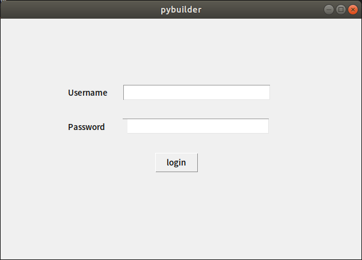
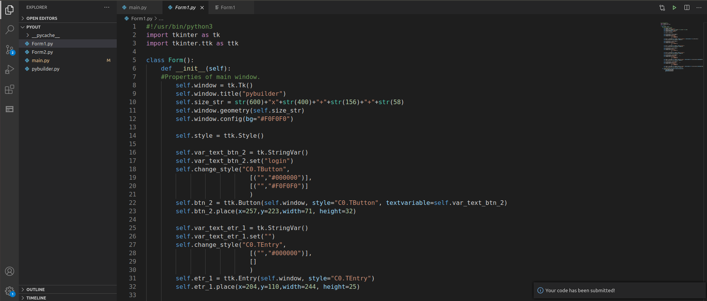

# pybuilder README

pybuilder is a vscode extension that can help users quickly build up a set of graphic interface using python's default graphic libaray tkinter.

## Features

pybuilder follows the principle of "what you see is what you get", you can easily build your own tkinter graphic interface with only keyboard and mouse, by dragging and pulling the elements, you can change their sizes and positions.
Pybuilder provides most of the basic pythin tkinter elements, including following elements:
* button
* entry
* label
* frame
* checkbutton
* radiobutton
* progressbar  
More elements will be added in later releases  

Choose 'arrow' in leftsied's treeview and click the elements you want to adjust, an attributeboard will pop out in the right side.  
There are total three parts of the attributeboard, including:   
* Attributes: Basic attributes.
* Binding Functions: Add Binding Functions to corresponding events.
* Other: Specific attributes for some elements. 

For basic attributes, pybuilder keeps most of the them variable, including following attributes:
* name(variable name when in python code)
* text(e.g. button's text)
* width
* height
* left
* top
* foreground color
* background color  

User can either adjust them by dragging and pulling or simply change them in attributeboard. 

For example if there is an image subfolder under your extension project workspace:  

  
  
  
  

## Requirements

python 3.7 or higher is required. 

## Extension Settings

Include if your extension adds any VS Code settings through the `contributes.configuration` extension point.

For example:

This extension contributes the following settings:

* `myExtension.enable`: enable/disable this extension
* `myExtension.thing`: set to `blah` to do something

